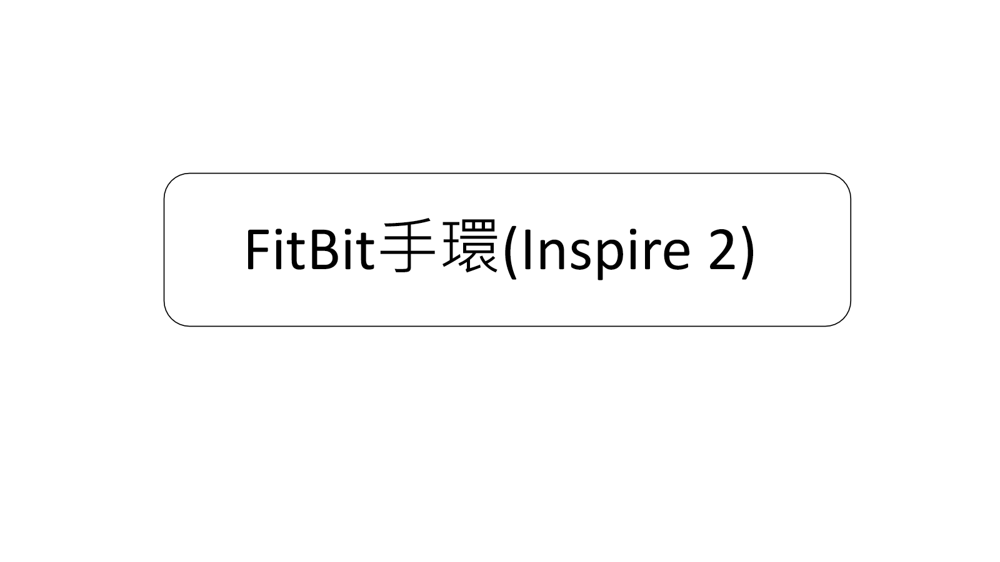
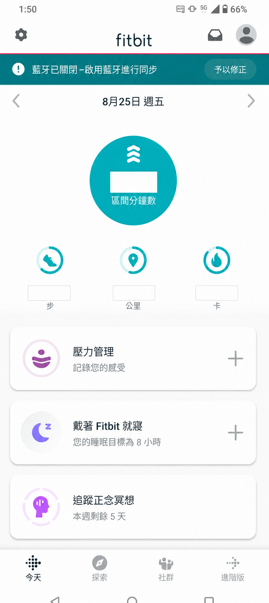
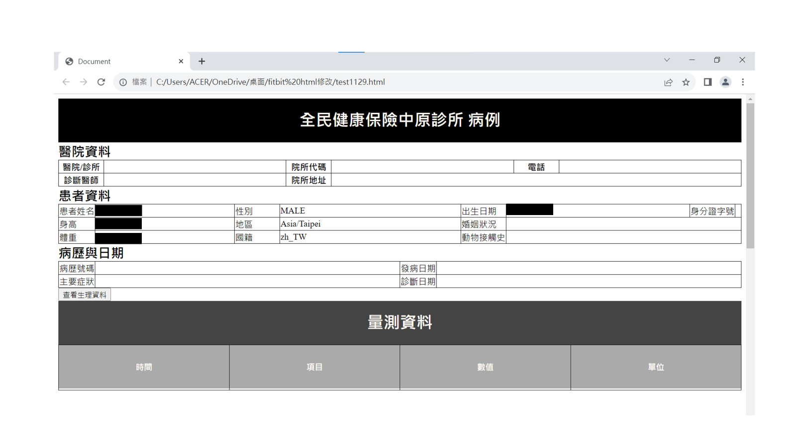
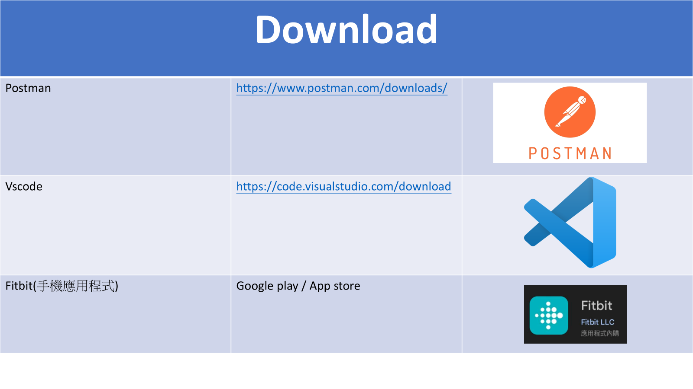
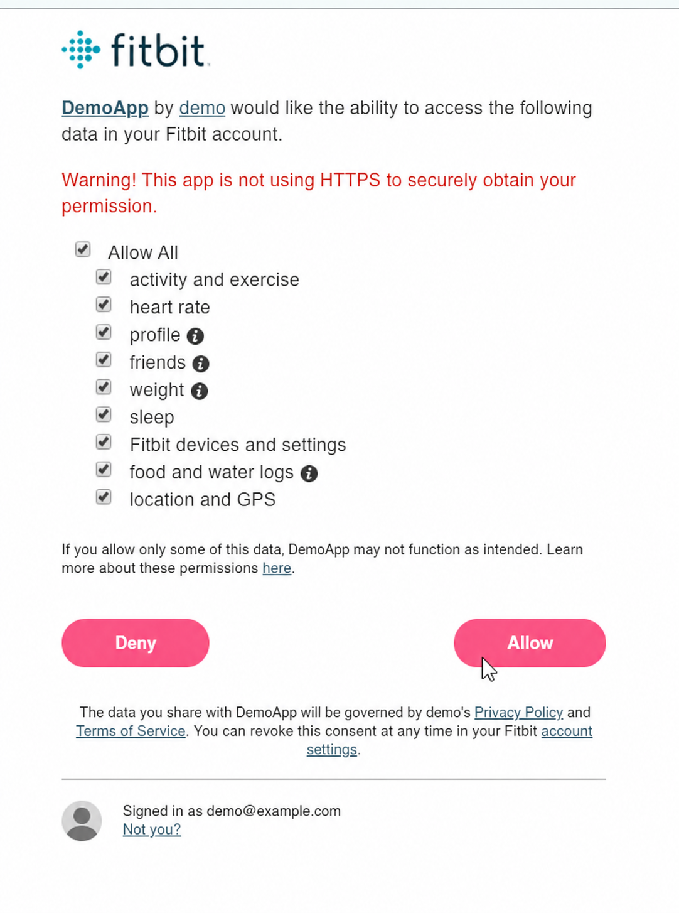

# Fitbit × FHIR 資料整合Demo

這是Fitbit Inspire 2 資料整合整理。示範如何透過 Fitbit 網頁 API 取得個人資料、心率與活動紀錄，填入院所介面的對應欄位，並將基本資料與生命徵象轉成 HL7 FHIR R4 `Patient`／`Observation` 資源。

> 這是教學材料，非正式醫療系統，也不應用於臨床判斷。

## 線上展示

**[開啟 GitHub Pages 線上展示](https://s960137.github.io/fitbit-fhir-integration-demo/)**

線上版本預設使用去識別化的模擬資料，不需要 Fitbit 存取權杖即可操作。可依序載入個人資料、取得心率與活動紀錄、產生 FHIR R4 `Bundle`，並下載產生的 JSON。若切換至 Fitbit API 模式，存取權杖只會暫存在目前瀏覽器工作階段，不會寫入程式碼或版本控制。



## 專案內容

- Fitbit 網頁 API 與 OAuth 2.0 的基本概念
- 個人資料、心率時間序列與活動紀錄 API 
- 將 Fitbit 個人資料顯示於院所表單欄位
- 將身高、體重與心率對應成 FHIR R4 `Bundle`
- 以模擬資料在沒有存取token的情況下展示流程
- 不把用戶端密鑰、存取token或個人健康資料寫入 Git

## 系統架構

```text
Fitbit 手環
    ↓ 同步
Fitbit 手機應用程式／雲端
    ↓ OAuth 2.0 存取權杖
Fitbit 網頁 API
    ↓ 個人資料、心率、活動紀錄
瀏覽器展示頁
    ├─ 院所表單預覽
    └─ 匯出 FHIR R4 Bundle
```

## 專案操作說明

以下畫面為 Fitbit Inspire 2 配對與同步、院所表單成果、開發工具及 Fitbit 授權頁面脈絡。所有畫面都去識別化；數值、帳號與患者資料僅作示意。

### 1. Fitbit Inspire 2 配對與同步

<p align="center">
  
</p>

先以 Fitbit 手機應用程式配對 Fitbit Inspire 2，並讓手環將步數、距離、熱量、心率等活動紀錄同步至 Fitbit 雲端。此畫面用來確認裝置與應用程式已完成同步。

### 2. 取得資料呈現院所表單

<p align="center">
  
</p>

取得授權後，程式透過 Fitbit 網頁 API 讀取個人資料、心率與活動紀錄，再把姓名、性別、生日、身高、體重、時區與語系等欄位整理至院所格式的網頁。接著可將基本資料與量測值對應為 FHIR R4 `Patient` 與 `Observation` 資源。圖中的黑色區塊是刻意遮蔽的資料；這是格式與傳輸流程原型，非正式醫院系統。

### 3. 使用工具

<p align="center">
  
</p>

- **Fitbit 手機應用程式**：配對手環、同步裝置與查看活動紀錄。
- **Postman**：測試 OAuth 權杖、API 端點、請求標頭與 Fitbit 回傳的 JSON。
- **Visual Studio Code**：編輯 HTML、CSS、JavaScript 與 FHIR JSON；也可使用其他程式碼編輯器。

### 4. Fitbit OAuth 授權許可

<p align="center">
  
</p>

程式要讀取 Fitbit 資料前，使用者必須在 Fitbit 授權頁面確認應用程式要求的權限，例如活動、心率、個人資料、體重與睡眠。按下 **Allow（允許）** 後，Fitbit 才會依 OAuth 2.0 流程將授權結果導回已註冊的重新導向網址；應用程式只能存取使用者同意的範圍。

此圖保留早期實作中的非 HTTPS 警告，僅用來呈現當時的練習流程。
正式環境必須使用 HTTPS、精確設定重新導向網址、只要求必要權限，並以 PKCE 或受保護的後端完成授權流程；用戶端密鑰、權杖與真實帳號不可放在前端或 GitHub。

## 本機執行

瀏覽器若直接開啟本機檔案，部分功能可能受安全政策限制。建議在專案目錄啟動簡單的靜態伺服器：

```bash
python -m http.server 8000
```

再開啟 `http://localhost:8000`。預設為「展示資料」模式，可直接載入個人資料、心率與活動紀錄並輸出 FHIR JSON。

## 使用 Fitbit API

1. 在 Fitbit 開發者入口網站建立應用程式並設定重新導向網址。
2. 使用 OAuth 2.0 授權碼流程（實際部署建議搭配 PKCE 或受保護的後端）。
3. 取得短效存取權杖。
4. 在畫面中切換至「Fitbit API」，並於本次工作階段貼上存取權杖。
5. 呼叫需要的 API 端點。

本專案不實作也不示範在前端交換用戶端密鑰。用戶端密鑰必須留在受保護的伺服器端環境。

### 使用的 API 端點

| 用途 | API 端點 |
| --- | --- |
| 使用者個人資料 | `GET /1/user/-/profile.json` |
| 指定日期範圍的心率 | `GET /1/user/-/activities/heart/date/{start}/{end}.json` |
| 活動紀錄清單 | `GET /1/user/-/activities/list.json` |

## FHIR 資料對應

| Fitbit 資料 | FHIR 資源 | 編碼 |
| --- | --- | --- |
| 個人資料 | `Patient` | 以編碼後的 Fitbit 使用者識別碼作為識別資訊 |
| 身高 | `Observation` | LOINC `8302-2`、UCUM `cm` |
| 體重 | `Observation` | LOINC `29463-7`、UCUM `kg` |
| 心率 | `Observation` | LOINC `8867-4`、UCUM `/min` |

本示範專案會匯出 `type: collection` 的 FHIR R4 `Bundle`。正式整合仍需處理身分比對、使用者同意、伺服器驗證、資料驗證、稽核紀錄、錯誤處理，以及接收端醫院的實作指南。

## 專案說明與圖片

- [OAuth 與 API 說明](docs/oauth-and-api-notes.md)
- [FHIR 資料對應說明](docs/fhir-mapping.md)
- [精選簡報圖片](docs/slides)
- [已去識別化的早期範例](legacy)

## 安全注意事項

- 絕對不要提交存取權杖、更新權杖、授權碼、用戶端密鑰、患者識別碼、出生日期或真實健康紀錄。
- 權杖欄位只會暫存在目前頁面工作階段的 JavaScript 記憶體中。
- 任何曾出現在原始碼、截圖、簡報、聊天紀錄或共用文件中的憑證，都應立即撤銷或更換。
- 修改此原型前，請先閱讀 [安全政策](SECURITY.md)。

## 專案目錄

```text
.
├── index.html                 # 主要展示介面
├── styles.css                # 響應式院所表單樣式
├── app.js                    # 模擬資料、Fitbit API 呼叫與 FHIR 資料對應
├── docs/                     # 技術說明與安全的簡報圖片
└── legacy/                   # 已去識別化的早期實驗版本
```

## 限制

- OAuth 權杖交換流程不放在瀏覽器展示中。
- 本專案未實作特定醫院的 FHIR 規範或正式環境驗證機制。
- Fitbit API 權限與端點可用性取決於註冊的應用程式及使用者同意範圍。
- 實際部署必須符合適用的隱私、安全與醫療相關規範。

--Author

徐良慶 (Jasper Hsu)

中原大學 生物醫學工程所 (Dept. of Biomedical Engineering, CYCU) | T&T 803 Lab
